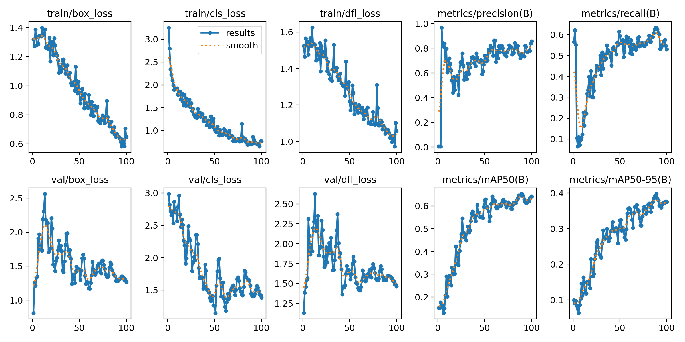
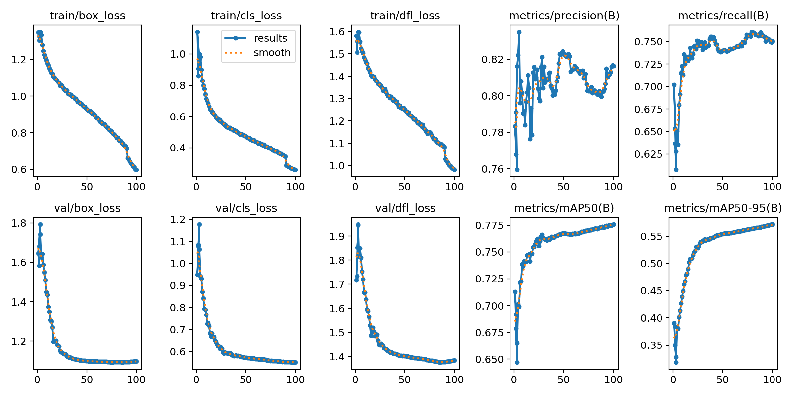

# 08 - Fra lokal produksjon til skyproduksjon av AI.

Etter suksessen med den innledende treningen på 163 bilder (dokumentert i kapittel 07), viste testing i reelle miljøer at modellen trengte langt mer data for å håndtere varierte lysforhold, vinkler og avstander. Dette kapittelet tar for seg overgangen fra en lokal prototype til en fullskala, sky-trent produksjonsmodell.

## 1. Dataskalering: Fra 163 til 22 000 bilder
For å øke modellens robusthet ("Recall" og "Precision"), var jeg avhengig av et massivt datasett. Å manuelt annotere ("tegne bokser på") titusenvis av bilder var ikke praktisk gjennomførbart. 

**Tidligere brukt løsning:** Jeg utviklet et skript som benyttet **Google Gemini 2.0 Flash API** (`auto_labeler.py`) for å automatisk identifisere og merke biler og bilskilt. 
* API-et returnerte koordinater som ble konvertert matematisk til YOLOv8 sitt normaliserte format (0.0 - 1.0).
* Resultatet ble et massivt datasett på over 22 000 unike bilder, ferdig annotert for klassene `car` og `license plate`.

## 2. Infrastruktur-skifte: Fra Lokal AMD til RunPod (RTX 4090)
Den lokale AMD RX 6700 XT-GPUen var essensiell for prototyping, men da datasettet vokste til 22 000 bilder, ble minnekapasiteten (VRAM) og prosesseringshastigheten en massiv flaskehals for videre fremdrift.

**Cloud Compute (RunPod):**
For den endelige treningen flyttet jeg arbeidslasten til skyplattformen **RunPod**. Her leide jeg en dedikert instans med en **NVIDIA RTX 4090 (24 GB VRAM)**. 
* **Hvorfor RTX 4090?** Den enorme mengden VRAM tillot meg å øke bildestørrelsen (`imgsz=1024`) og batch-størrelsen betraktelig. Dette sørget for at modellen kunne lære av høyoppløselige detaljer (kritiske for små bilskilt) på en brøkdel av tiden det ville tatt lokalt.

## 3. Analyse av Treningsresultater
Gjennom treningen utførte jeg flere iterasjoner for å optimalisere "Hyperparameters" (epoker, læringsrate, augmentering). 
Det har blitt brukt ulike batches, ulike tall på epochs - det har blitt brukt albumenteringer, det har blitt endret i pixel format for image size=1024 -  hvor dette var på 640.
Grunnen til at dette ble økt var fordi jeg så at det treningen ble dårligere jo større settet var - men det var fordi ting ble veldig ujevnt og dårlig pikslert for den kunstige modellen. Dermed måtte image size få bedre oppløsning slik at treningen ble mer presis.

Disse resultatene er vist i:
[Alle resultatene](../PyTorch/results/)

### Tidlige Iterasjoner
I de tidlige fasene av oppskaleringen observerte jeg at modellen raskt klarte å identifisere biler, men slet med stabil "Loss"-reduksjon på bilskilt på grunn av støy og små detaljer.

*(Over: `results.png` viser de tidlige svingningene i læringskurven).*

### Den Endelige Modellen: `best.pt`
Kjøringen på RunPod med 22 000 bilder produserte min hittil kraftigste modell. Grafene viser en læringskurve ("Convergence") i absolutt toppklasse:

* **Box Loss & Object Loss:** Jeg ser et bratt, jevnt fall i både trenings- og validerings-loss. Dette betyr at modellen ikke bare pugger dataene ("overfitting"), men faktisk lærer å generalisere og forstå *hva* et bilskilt er.
* **Precision & Recall:** Begge metrikkene skyter raskt opp og stabiliserer seg tett opp mot 1.0. Dette betyr at når AI-en sier den ser et skilt, er det nesten garantert riktig (Precision), og den overser nesten ingen faktiske skilt i bildet (Recall).
* **mAP50 (Mean Average Precision):** Stabiliserer seg på et eksepsjonelt høyt nivå, som bekrefter at modellen er produksjonsklar for krevende Edge-miljøer.
* **mAP50 ENDELIG RESULTAT:** resulterte med 0.95 på license plate som er skyhøyt, og det er det høyeste tallet oppnådd noensinne i løpet av den hele totale treningen.
* **Totalt tid brukt:** Treningen tok totalt 18 timer - og dette var i skyene hvor lokalt så var dette estimert flere dager - derfor gikk løsning til **RUNPOD**.

## Oppsummering
Kombinasjonen av **Gemini 2.0 Flash** for skalerbar datagenerering og **NVIDIA RTX 4090 (RunPod)** for rå regnekraft, ga meg en modell (`best.pt`) som overgår alle tidligere prototyper. Modellen er nå kapabel til å levere lynrask, høyoppløselig skilt-deteksjon – og har klart å integrere seg med EasyOCR i selve infrastrukturen.