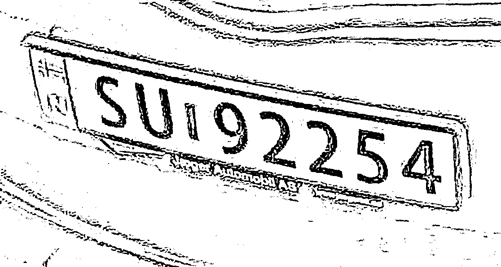

# Systemtesting og Optimalisering av Videostrøm

Med den nye infrastrukturen på plass (RTSP via Tailscale og YOLO - modell `best.pt` på Pi 5), gikk prosjektet over i en kritisk testfase. Målet var å verifisere at systemet ikke bare fungerte i korte øyeblikk, men at det kunne stå i kontinuerlig drift (oppetid) uten å knele.

## 1. Første Test:
Den første "Live-testen" var umiddelbart vellykket. Raspberry Pi 4-enheten klarte å fange opp videostrømmen fra det nye Global Shutter-kameraet og sende den over Tailscale til Pi 5. Systemet detekterte biler og skilt i sanntid - men leste skilt ofte feil. Der dette er motoren til EasyOCR som er installert og importert - fordi `best-pt` er å finne ut om det er en bil - og om det er en skiltplate og deretter tegne Bounding Boksene slik at EasyOCR kan gjøre jobben med å lese.

**Problemet:** Under kortidsstesting, begynte Raspberry Pi 4-enheten å slite. Til slutt frøs videostrømmen, og maskinen krasjet totalt (Out of Memory / Thermal Throttling).

## 2. Feilsøking og Diagnose av Flaskehalsen
For å finne årsaken til krasjet, måtte man analysere ressursbruken på kamera-noden (Pi 4). Problemet viste seg å ligge i en overbelastning av maskinvarekodingen (Hardware Encoding) i FFmpeg.

To faktorer forårsaket overbelastningen:
1. **For høy oppdateringsfrekvens (60 FPS):** Å be Pi 4 om å komprimere og sende 60 bilder i sekundet kontinuerlig krevde mer prosessorkraft enn maskinen kunne levere stabilt over tid.
2. **For høy Bitrate (8 Mbps):** Bitrate styrer hvor mye data som brukes per sekund med video. Den opprinnelige konfigurasjonen tillot systemet å dytte opptil 8 Megabits per sekund (8M). Kombinasjonen av høy FPS og høy datamengde førte til at køen for videoprosessering fylte opp maskinens RAM, noe som til slutt forårsaket krasjet.

## 3. Justeringer for Produksjonsmiljø
For å oppnå et driftssikkert system måtte man finne balansepunktet ("sweet spot") mellom god nok bildekvalitet for AI-en, og lav nok belastning for maskinvaren. Etter flere iterasjoner landet jeg på følgende konfigurasjon:

* **Maks 30 FPS:** Kameraopptaket ble halvert fra 60 til 30 bilder i sekundet. Dette fjernet den massive belastningen på prosessoren, samtidig som det var mer enn raskt nok til å fange biler i bevegelse (takket være Global Shutter-sensoren) - global shutter med bra nok oppløsningen reddet oppgaven - ellers hadde dette aldri funket.
* **Maks 4M Bitrate (4 Mbps):** Jeg la inn en hard grense på båndbredden (`-maxrate 4M`). Dette tvinger systemet til å aldri overstige 4 Megabits per sekund. Bildekvaliteten i 720p holdt seg fortsatt krystallklar, men datamengden Pi-en måtte håndtere ble halvert.

## 4. Resultat av Utholdenhetstest
Etter at FFmpeg-stacken ble oppdatert med grensene på 30 FPS og 4 Mbps, ble systemet satt på en ny korttidstest.

Resultatet var en massiv suksess. Minnebruken stabiliserte seg, temperaturen på Pi 4 forble innenfor trygge marginer, og RTSP-strømmen kunne stå og gå i mer enn 2 timer uten et eneste krasj. AI-modellen på Pi 5 mottok en jevn, stabil strøm av høyoppløselige bilder, noe som sikret at EasyOCR konsekvent klarte å trekke ut skiltnummer - men ofte ble dette feil. Så da var EasyOCR det neste problemet.

## 5. Tesseract

Ettersom EasyOCR konsekvent feilet på skiltlesingen til tross for en stabil videostrøm, ble testingen flyttet til en ny Git-branch for å utforske en alternativ OCR-motor: **Tesseract**. Tesseract anses generelt som en ekspert på å lese ren tekst fra bilder, og målet med prosjektet var tross alt å lese skiltplaten korrekt - fordi vi trekker ut registreringskiltet som en streng.

Det viste seg imidlertid uventede 'hull' i sifrene da de ble forstørret og prosessert. Da Tesseract forstørret teksten inne i bounding boksen for `license plate`, ble det avdekket uønskede "hvite hull" midt i selve tallene. Sifrene og bokstavene var ikke bleksvarte og solide slik OCR-motoren forventet, men ujevne -> det førte til at feilesingen skjedde ofte.

Disse ujevnhetene og hullene gjorde tegnene utydelige for OCR-motoren. Når tallene ikke var bleksvarte og definerte, bommet Tesseract og returnerte feil tegn. Dette bekreftet at problemet nå lå i selve tegnkvaliteten *etter* deteksjon, snarere enn i AI-modellenes evne til å finne skiltet.

Dette skiftet krevde betydelige endringer i koden for forhåndsbehandling av bildene (preprocessing) før de ble sendt til Tesseract-motoren. For å optimalisere resultatene ble det lagt inn logikk for:

* **Forstørrelse:** Bounding boksen for `license plate` ble oppskalert for å gi Tesseract flere piksler å jobbe med.
* **Gråtonekonvertering (Grey):** Bildet ble gjort svart-hvitt for å fjerne støyende fargeinformasjon.
* **Dilasjon (Dilation):** Morfologiske operasjoner ble brukt for å utvide og forsterke tegnene.

Man måtte faktisk se hva OCR driver egentlig og ser på - og legge til forstørrelse resulterte dette mye bedre - men fortsatt ikke bra nok.

## 6. Veien tilbake til EasyOCR med logikk fra Tesseract
* **Finale testen:** Basert på funnene som dukket opp med Tesseract, så ga man det et forsøk til med EasyOCR - og da viste resultatene seg endelig
Skiltet ble tatt i fart, og bommet svært lite i forhold til hva den gjorde før - den var mye mer presis - og med tanke på begrensninger i form av video-strøm og hardware så var dette er minimum viable product som faktisk fungerer -  men ikke perfekt.

* **Bilder av suksess:** Basert på finale testen, så klarte den å identifisere riktig skiltnummer i sanntid - der bilen også befant seg i lav fart.
Disse bildene ligger under [BILDER SUKSESS](../PyTorch/success/) 

> **Personvernmerknad: * - Eier av reporisiteriet aksepterer at bildene av min egen bil befinner seg for akademisk sensur og forståelse av hvordan prosjektet har utviklet seg* 

* **Konklusjonen av testingen:** Dette viser også at den gjør feil - men det er optimalt med tanke på hardwaren som befinner seg for dette prosjektet med tanke på at selskaper har kameraer til over 60 000 kroner med en innebygd AI i dem.

